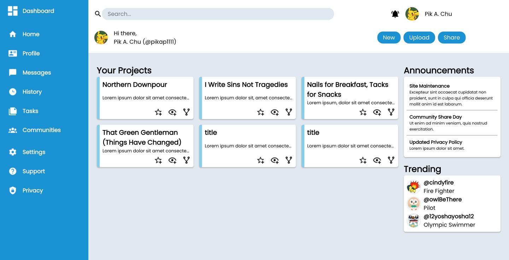
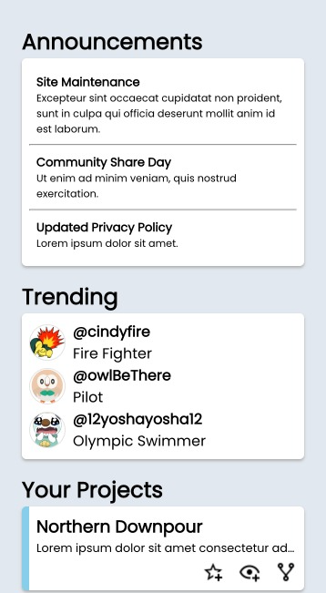

# TOP - Admin Dashboard

## Create an Admin Dashboard with HTML & CSS using the provided design.

- [x] Use Flex and Grid Layouts
- [x] Use the provided assets

  
Web View

  

  
Mobile View

  

